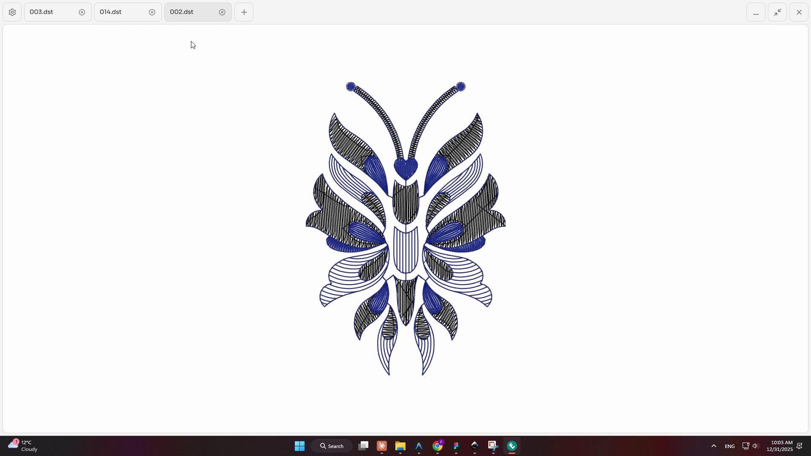

# EmbroCAD

Embroidery design preview software built with Tauri, React, and Rust.



## Features

- **DST File Support** - Parse and render Tajima DST embroidery files
- **Realistic Thread Preview** - 3D thread visualization with shadow and highlight effects
- **Drag & Drop** - Simply drop your .DST file to preview
- **Fast Rendering** - Rust-powered parsing for instant loading

## Tech Stack

- **Tauri**: Modern Desktop/Mobile App Technology
- **Frontend**: React 19, TypeScript, Vite
- **Backend**: Rust, Tauri 2
- **Styling**: Vanilla CSS

## Development

### Prerequisites

- [Bun](https://bun.sh/) (package manager)
- [Rust](https://www.rust-lang.org/tools/install)

### Setup

```bash
# Install dependencies
bun install

# Run in development mode
bun run tauri dev
```

### Build

```bash
bun run tauri build
```

## Project Structure

```sh
EmbroCAD/
├── src/                   # React frontend
│   ├── App.tsx            # Main application component
│   ├── App.css            # Styles
│   └── main.tsx           # Entry point
├── src-tauri/             # Rust backend
│   └── src/
│       ├── lib.rs         # Tauri commands
│       ├── main.rs        # Entry point
│       └── dst/           # DST parser module
│           ├── mod.rs
│           ├── parser.rs  # DST file parsing
│           └── types.rs   # Data structures
└── public/                # Static assets
```

## License

MIT License - see [LICENSE.md](LICENSE.md)
